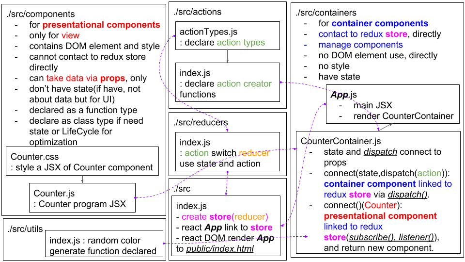

# Redux practice(Color Changing Counter)
Counter with color changing. Redux applied to React.

## Functions
- left click: increase count
- right click: decrease count
- left double click: change color

## Architecture(UML diagram like)

  

## Reference
Redux tutorial - Velopert Blog [Redux 정복하기 1장](https://velopert.com/3346)
