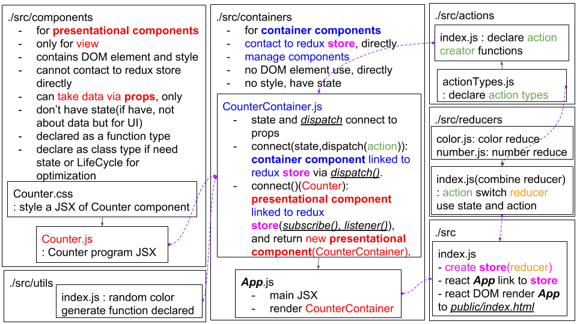
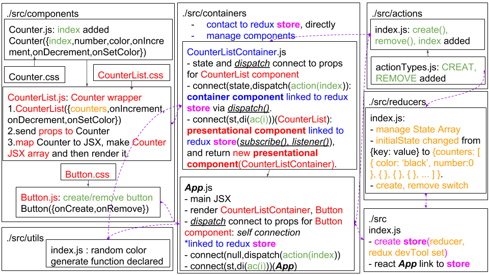

# Redux practice(Color Changing Counter)
Counter with color changing. Redux applied to React.

## Functions
- 생성 button: Add one more counter at the end of the 'counter states management array'
- 제거 button: Remove last counter of the 'counter states management array'
- left click: increase count
- right click: decrease count
- left double click: change color

## Structure(UML diagram like)

  
   mono-counter structure. react-redux applied.

  
   multi-counter structure. react-redux applied.

## Reference
- mono-counter structure: Redux tutorial - Velopert Blog [Redux 정복하기 1장](https://velopert.com/3346)
- multi-counter structure: Redux tutorial - Velopert Blog [Redux 정복하기 2장](https://velopert.com/3352)
